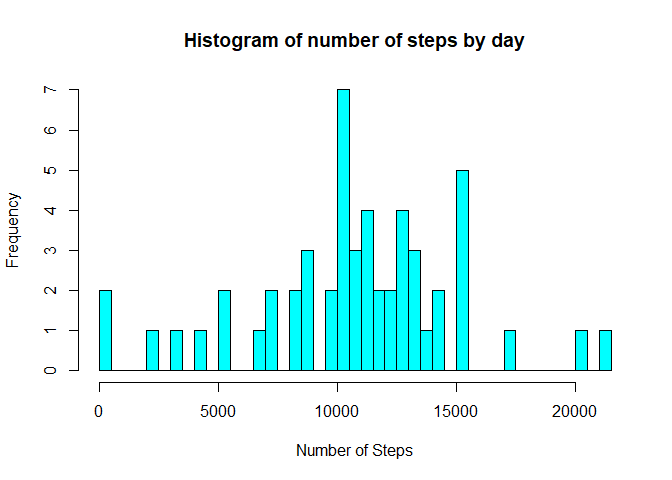
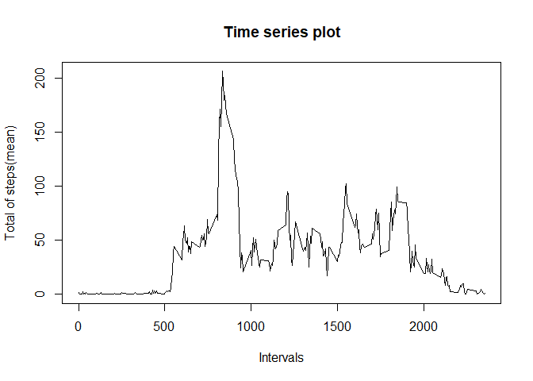
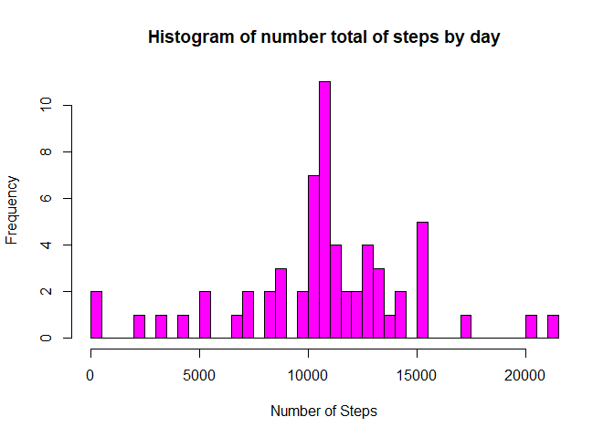
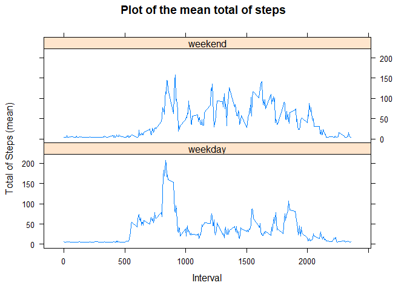

## Reproducible Research

### Loading and preprocessing the data

```r
df = read.csv("activity.csv")
str(df)
```

```
## 'data.frame':	17568 obs. of  3 variables:
##  $ steps   : int  NA NA NA NA NA NA NA NA NA NA ...
##  $ date    : Factor w/ 61 levels "2012-10-01","2012-10-02",..: 1 1 1 1 1 1 1 1 1 1 ...
##  $ interval: int  0 5 10 15 20 25 30 35 40 45 ...
```

```r
# converting the format from date coloumn to date:
df$date <-  as.Date(df$date, format = "%Y-%m-%d")
class(df$date)
```

```
## [1] "Date"
```
### some visualizations from the data


```r
head(df)
```

```
##   steps       date interval
## 1    NA 2012-10-01        0
## 2    NA 2012-10-01        5
## 3    NA 2012-10-01       10
## 4    NA 2012-10-01       15
## 5    NA 2012-10-01       20
## 6    NA 2012-10-01       25
```

```r
summary(df)
```

```
##      steps             date               interval     
##  Min.   :  0.00   Min.   :2012-10-01   Min.   :   0.0  
##  1st Qu.:  0.00   1st Qu.:2012-10-16   1st Qu.: 588.8  
##  Median :  0.00   Median :2012-10-31   Median :1177.5  
##  Mean   : 37.38   Mean   :2012-10-31   Mean   :1177.5  
##  3rd Qu.: 12.00   3rd Qu.:2012-11-15   3rd Qu.:1766.2  
##  Max.   :806.00   Max.   :2012-11-30   Max.   :2355.0  
##  NA's   :2304
```
### What is mean total number of steps taken per day?

```r
df_day <-  ddply(df,~date,summarise,total = sum(steps),mean=mean(steps))
```
#### 1. plotting the histogram:

```r
hist(df_day$total,breaks = 60,main = "Histogram of number of steps by day",xlab = "Number of Steps",col = "cyan")
```

<!-- -->

#### 2. The mean and median of the total number of steps taken per day:

```r
cat(print("Mean of total number of steps:"),mean(df_day$total,na.rm = TRUE))
```

```
## [1] "Mean of total number of steps:"
## Mean of total number of steps: 10766.19
```

```r
cat(print("Median of total number of steps:"),median(df_day$total,na.rm = TRUE))
```

```
## [1] "Median of total number of steps:"
## Median of total number of steps: 10765
```

### What is the average daily activity pattern?
#### 1. Time series plot of the average number of steps taken:

```r
# mean and median from the steps taken each day
df_mean <-  ddply(df,~interval,summarise,mean = mean(steps,na.rm = TRUE))
# Time series plot of the average number of steps taken
plot(x=df_mean$interval,y=df_mean$mean, type = "l",main = "Time series plot",xlab = "Intervals",
     ylab = "Total of steps(mean)")
```

<!-- -->

#### 2.Which 5-minute interval, on average across all the days in the dataset, contains the maximum number of steps?

```r
# 2. The 5-minute interval that, on average, contains the maximum number of steps
interval_maxmean <- ddply(df,~interval,summarise,mean = mean(steps,na.rm = TRUE))%>%filter(mean==max(mean))

# interval that contains the maximum number of steps, on average
print(paste("The interval which contains the maximum number of steps, on average is the interval",interval_maxmean$interval),quote = FALSE)
```

```
## [1] The interval which contains the maximum number of steps, on average is the interval 835
```

### Imputing missing values
#### 1. the total number of missing values in the dataset:

```r
cat(print("Total of missing values in the steps variable:"),sum(is.na(df$steps)))
```

```
## [1] "Total of missing values in the steps variable:"
## Total of missing values in the steps variable: 2304
```

#### 2. Strategy for filling in all of the missing values in the dataset:

I decided to imputing the general steps mean into the steps missing values.


```r
# filling the missing values with the mean of steps
df$steps[is.na(df$steps)] <-  round(mean(df$steps,na.rm=TRUE))   
sum(is.na(df$steps)) # the missing values were removed
```

```
## [1] 0
```

#### 3. Creating a new dataset that is equal to the original dataset but with the missing data filled in:

```r
# a new dataset without missing values
df2 <- df
head(df2,3)
```

```
##   steps       date interval
## 1    37 2012-10-01        0
## 2    37 2012-10-01        5
## 3    37 2012-10-01       10
```

#### 4. Making a histogram of the total number of steps taken each day and Calculate and report the mean and median total number of steps taken per day. 

```r
# summarizing the data by day
df2_day <-  ddply(df2,~date,summarise,total = sum(steps),mean=mean(steps))

hist(df2_day$total,breaks = 60,main = "Histogram of number total of steps by day",xlab = "Number of Steps",col = "magenta")
```

<!-- -->

#### Mean and median of total number of steps taken per day after filling NA's values:


```r
cat(print("Mean of total number of steps:"),mean(df2_day$total,na.rm = TRUE))
```

```
## [1] "Mean of total number of steps:"
## Mean of total number of steps: 10751.74
```

```r
cat(print("Median of total number of steps:"),median(df2_day$total,na.rm = TRUE))
```

```
## [1] "Median of total number of steps:"
## Median of total number of steps: 10656
```

In this case, the imputing of missing values with the mean value impacted on the estimates of the total daily number of steps:

```r
cat(print("The impact of imputing missing values:"),sum(df2_day$total)-sum(df_day$total,na.rm = TRUE), "more steps.")
```

```
## [1] "The impact of imputing missing values:"
## The impact of imputing missing values: 85248 more steps.
```

### Are there differences in activity patterns between weekdays and weekends?
#### 1. creating a new coloumn in the original dataset with the "weekday" or "weekend" values:


```r
# creatina a new coloumn called "day" with the levels "weekend" and "weekday".  
df2$day <- ifelse((weekdays(df2$date) == "sábado") | (weekdays(df2$date) == "domingo"),"weekend","weekday")
table(df2$day)
```

```
## 
## weekday weekend 
##   12960    4608
```

```r
# converting the new coloumn in factor 
df2$day = as.factor(df2$day)
```


```r
# creating a object to summarize the data
df2_mean <-  ddply(df2,interval~day,summarise,mean = mean(steps))
```

#### 2. Making a Panel plot containing a time series plot of the 5-minute interval

```r
library(lattice)
attach(df2_mean)
xyplot(mean~interval|day,type="l",layout=c(1,2),
       xlab='Interval',ylab='Total of Steps (mean)', main = "Plot of the mean total of steps")
```

<!-- -->


